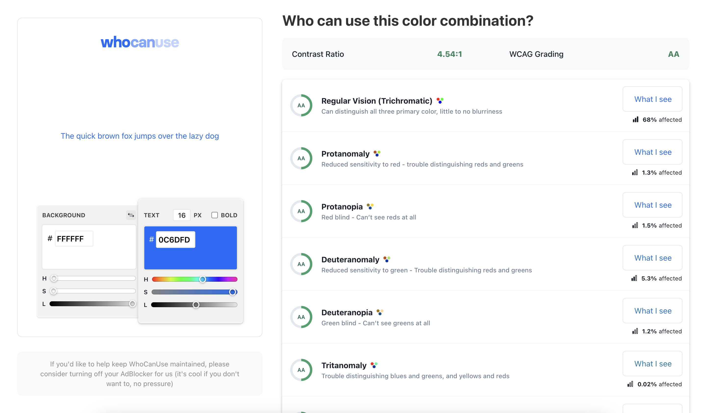
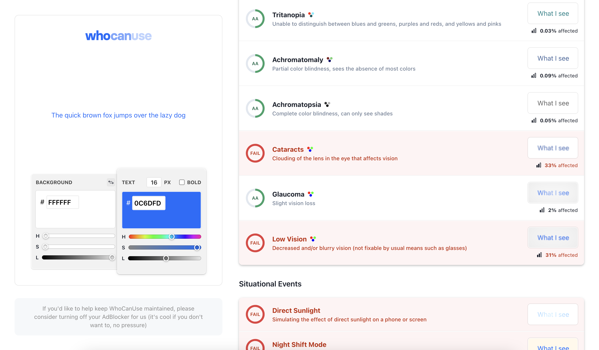
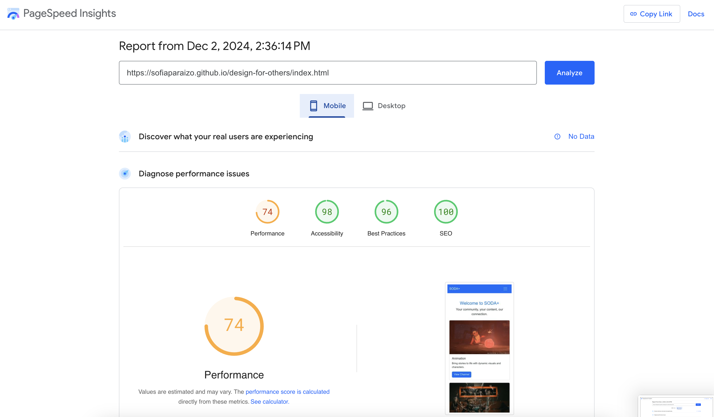
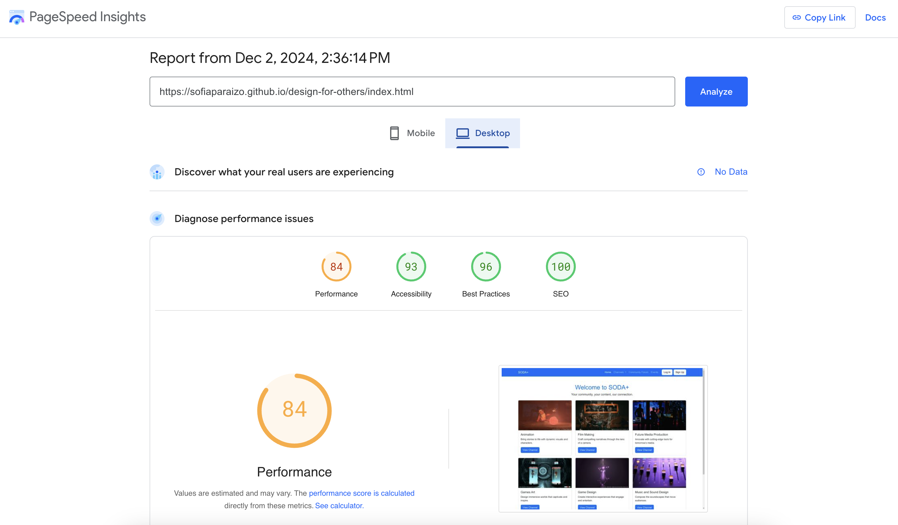

# 👩‍💻 SODA+  |  Design for Others

## About the Project
This project is designed to create a comprehensive streaming hub platform tailored for SODA (School of Digital Arts) students at Manchester Metropolitan University. It is a centralised space where students can access exclusive content, including educational videos, tutorials, and community-driven resources.

## Performance Insights
Using tools like [WhoCanUse](https://www.whocanuse.com/?bg=ffffff&fg=0c6dfd&fs=16&fw=), [PageSpeed Insights](https://pagespeed.web.dev/analysis/https-sofiaparaizo-github-io-design-for-others-index-html/2yz66t7c4v?form_factor=mobile), and [WAVE Evaluation Tool](https://wave.webaim.org/report#/https://sofiaparaizo.github.io/design-for-others/index.html), I conducted a thorough review of my design and content to ensure it aligns with WCAG standards for accessibility and performance. These tools helped me identify areas where improvements were needed, such as colour contrast, navigation structure, and responsive design. By addressing these issues, I aimed to create a user-friendly experience that is inclusive for all users, including those with disabilities. This process also allowed me to validate my choices and demonstrate a commitment to accessibility and usability throughout the project.
- [WhoCanUse:](https://www.whocanuse.com/?bg=ffffff&fg=0c6dfd&fs=16&fw=) The chosen colour scheme (white background and blue accent) passed 10 of 14 accessibility tests, ensuring sufficient contrast for most users, including those with visual impairments. However, it flagged some issues for specific needs, such as those suffering from cataracts, low vision, direct sunlight, and night shift mode.

- [PageSpeed Insights:](https://pagespeed.web.dev/analysis/https-sofiaparaizo-github-io-design-for-others-index-html/2yz66t7c4v?form_factor=mobile) I tested the performance of the website using PageSpeed Insights, which highlighted several areas for improvement, particularly in terms of loading time, unused CSS & JavaScript and layout shifts. The mobile version of the site scored lower than the desktop version, with issues related to image optimization and JavaScript execution. These adjustments would help the site load faster, ensuring a better user experience, especially for mobile users.

- [WAVE Evaluation Tool:](https://wave.webaim.org/report#/https://sofiaparaizo.github.io/design-for-others/index.html) Using the WAVE Evaluation Tool, I conducted an accessibility review of my website to ensure it meets key standards. This tool did not identify any errors and contract errors but gave a few alerts regarding skipped heading levels and redundant links.

## Recommendations
Based on the insights gathered from the performance and accessibility tools, the following improvements are recommended to enhance the overall user experience of the SODA+ platform:

- **Colour Contrast Adjustments:** While the chosen colour scheme passed most accessibility tests, it flagged issues for users with specific needs, such as those with cataracts or low vision. To ensure the platform is accessible to a broader range of users, I recommend refining the colour contrast between text and background. This can be achieved by using slightly darker hues or employing tools like Contrast Checker to verify that the contrast meets WCAG 2.0 standards.
- **Performance Optimisation:** The PageSpeed Insights report identified several areas for improvement, particularly for mobile users. Optimising images for faster loading, reducing unused CSS and JavaScript, and improving JavaScript execution will help enhance site performance. These adjustments will ensure a smoother experience for users, particularly those with slower internet connections or mobile data constraints.
- **Navigation Structure Enhancements:** The WAVE Evaluation Tool flagged issues with skipped heading levels and redundant links. To improve accessibility, it’s essential to maintain a logical and well-structured navigation system. I recommend revising the heading structure to ensure a clear, hierarchical organisation and removing any redundant or unnecessary links that could confuse users, particularly those using screen readers.
- **Mobile Optimisation:** As the mobile version of the site scored lower in the PageSpeed Insights, it’s crucial to prioritise mobile-first design principles. Ensuring that the layout is responsive and that images are optimised for smaller screens will significantly enhance the user experience for mobile users, who may be accessing the platform on the go.

By addressing these areas, the SODA+ platform will provide a more inclusive, user-friendly, and efficient experience for all students at the School of Digital Arts.
